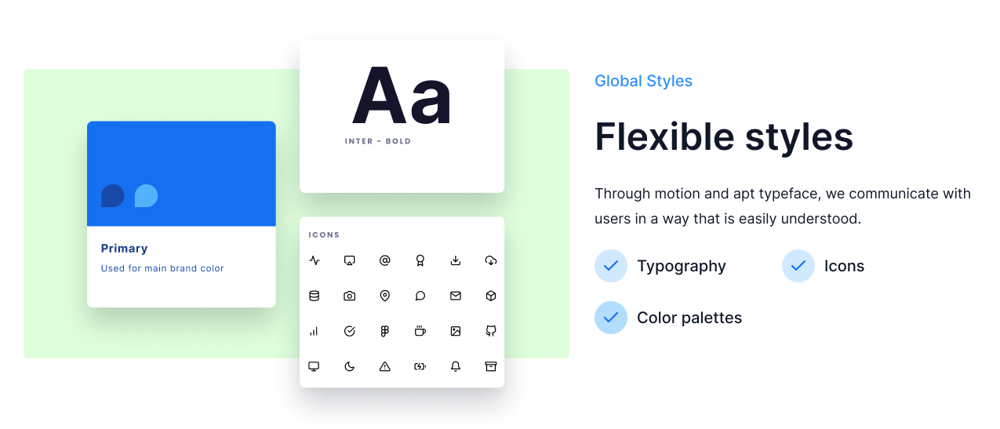

<div align='center'>
   </img>
   <h1>Tlt Design Flutter Package</h1>
   <p>
      Tlt Design is a comprehensive Flutter package that brings the <a href="https://tltdesign.tandemloop.net/" target="_blank">Tandemloop Design System</a> to your Flutter applications. <b>Tltdesign</b> includes typography, icons, colors, and over 15 custom widgets to enhance your app development experience.
   </p>
   <!-- <div>
      <a title="pub.dev" href="https://pub.dartlang.org/packages/fluent_ui" >
        
      </a>
      <a title="GitHub License" href="https://github.com/bdlukaa/fluent_ui/blob/master/LICENSE">
        
      </a>
      <a title="Web Example" href="https://bdlukaa.github.io/fluent_ui">
        
      </a>
      <a title="Discord" href="https://discord.gg/674gpDQUVq">
        
      </a>
   </div> -->
</div>

---

## Table of Contents

- [Installation](#installation)
- [Usage](#usage)
- [Features](#features)
  - [Colors](#colors)
  - [Typography](#typography)
  - [Icons](#icons)
  <!-- - [Shadows]()
  - [Blur]()
  - [Helpers]() -->
- [Widgets](#widgets)
- [Example](#example)
- [Contributing](#contributing)
- [License](#license)

## Installation

To use Tlt Design in your Flutter project, add the following to your `pubspec.yaml` file:

```yaml
dependencies:
  tlt_design: ^1.0.0
```

then run

```bash
$ flutter pub get
```

## Usage

```dart
import 'package:tlt_design/tlt_design.dart';

...
child: TltButton(
        text: 'Click me',
        onTap: () {},
    ),
...
```

# Features



## Colors

Tlt Design comes with a predefined color palette to maintain a consistent look and feel. Access colors through the TltColors class:

<!--  -->

```dart
Container(
  color: TltColors.blue,
  child: Text('Blue Color'),
),
```

## Typography

Tlt Design provides a set of predefined text styles to maintain consistency across your app. To use them, simply access the TltTypography class:

```dart
Text(
  'Hello, Tlt Design! - Heading 1',
  style: TltStyles.heading1,
),
```

## Icons

Tlt Design offers two sets of icons: TltIcons and TltIcons2. TltIcons includes basic icons from Tandemloop, while TltIcons2 is based on the [Iconsax](https://iconsax.io/) collection.

usage example

```dart
Icon(TltIcons.home), // Using TltIcons
Icon(TltIcons2.user), // Using TltIcons2 from Iconsax
```

## Widgets

Tlt Design comes with over 25+ custom widgets. Here's how you might use a button:

```dart
TltButton(
    text: 'Button',
    padding: const EdgeInsets.symmetric(
        horizontal: 16,
        vertical: 10,
    ),
    buttonSize: TltSize.lg,
    suffix: const Icon(
        TltIcons.chevron_down,
        color: TltColors.white,
    ),
    onTap: () {},
),
```

## Example

For a complete example demonstrating how to use the Tlt Design package, please refer to the [example](example/) directory in this repository.

## Contributing

This package is developed and maintained by [Tandemloop](https://tandemloop.in/home/), a dynamic startup based in Bangalore. The magical journey of the Tlt Design package has been spearheaded by a dedicated team of developers passionate about elevating the Flutter development experience.

### The Team

- [Gopi](https://github.com/Gopi-p) - The visionary behind the architecture and standards.
- [Ajay](https://github.com/Che-ekU) - The wizard of widgets and design.
- Alfahad - The guru of stability and performance.
<!-- - [Alfahad](https://github.com/developer3) - The guru of stability and performance. -->

We warmly welcome contributions from the community. Whether you're looking to fix a bug, enhance existing features, or propose entirely new components, your input is invaluable in making the Tlt Design package even more remarkable.

For more information on how you can contribute, please visit our [Contributing Guidelines](CONTRIBUTING.md) document.

## License

Tlt Design is released under the MIT license with additional restriction. Please see the [LICENSE](LICENSE) file for more information.
